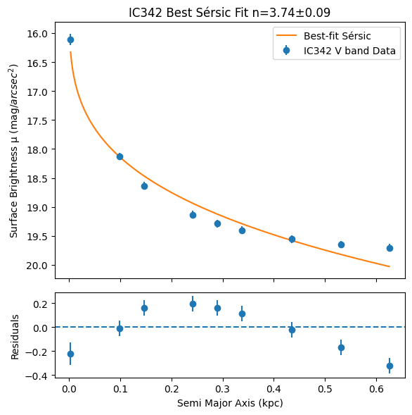
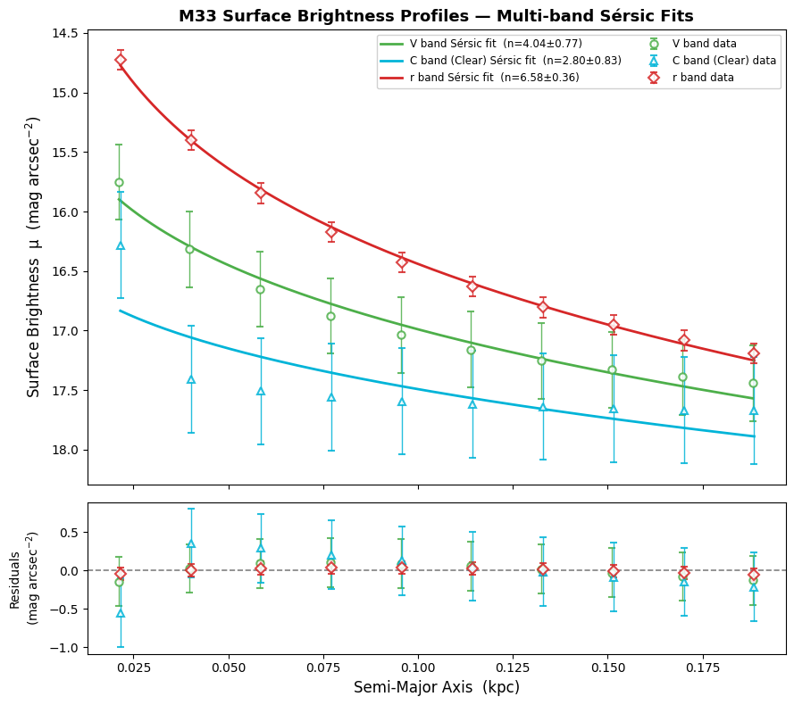
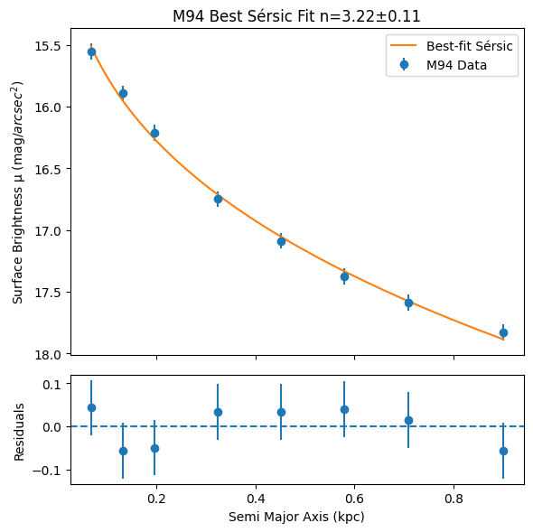
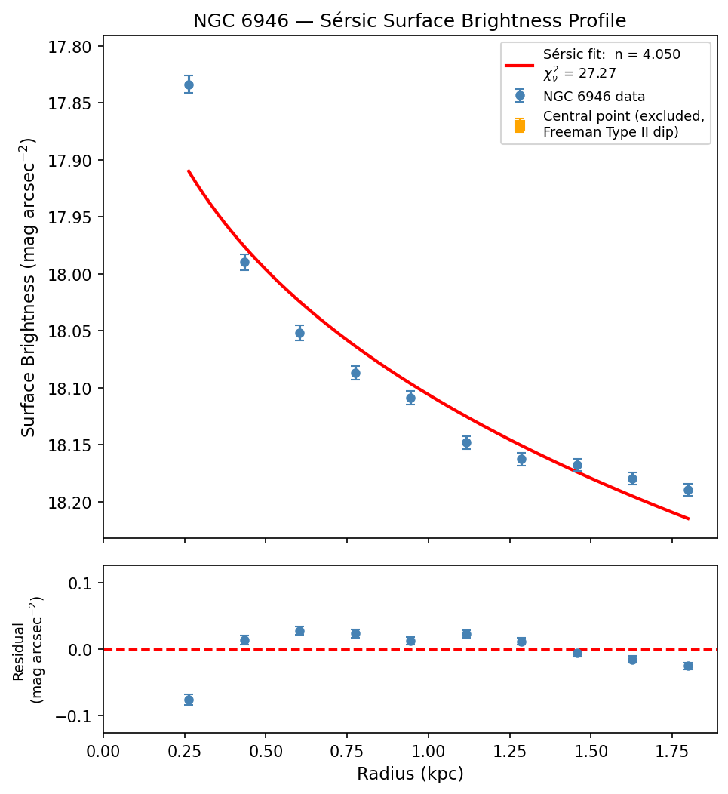

# Galaxy Sérsic Profile Fitting

## Overview

This project investigates the surface-brightness profiles of galaxies using Sérsic profile fitting.

The analysis was developed as part of a university physics laboratory project and uses Python to process astronomical data, fit Sérsic models, estimate parameter uncertainties, and assess the quality of the fits using reduced χ².

## Scientific Background

A Sérsic profile is commonly used to describe how the surface brightness of a galaxy varies with radius:

$$
\mu(r) = \mu_e + 1.0857b_n\left[\left(\frac{r}{r_e}\right)^{1/n}-1\right]
$$

where:

* \(\mu(r)\) is the surface brightness at radius \(r\)
* \(\mu_e\) is the surface brightness at the effective radius
* \(r_e\) is the effective radius
* \(n\) is the Sérsic index
* \(b_n\) is a coefficient dependent on the Sérsic index

The Sérsic index provides information about the shape and concentration of a galaxy's light profile — for reference, n ≈ 1 corresponds to an exponential disk, n ≈ 4 to a classical de Vaucouleurs profile typical of elliptical galaxies and bulges.

## Method

The Python analysis:

1. Processes galaxy surface-brightness measurements as a function of radius.
2. Propagates measurement uncertainties.
3. Models the observed profiles using Sérsic functions.
4. Optimises the model parameters against the observational data.
5. Calculates reduced χ² values to assess goodness of fit.
6. Produces plots comparing the measured profiles with the fitted models.

Different fitting approaches were investigated depending on the characteristics of the available datasets.

## Results

| Galaxy | Band(s) | Sérsic index (n) | Notes |
|---|---|---|---|
| IC 342 | V | 3.74 ± 0.09 | Good fit across the sampled radius range |
| M33 | V / C (Clear) / r | 4.04 ± 0.77 / 2.80 ± 0.83 / 6.58 ± 0.36 | Multi-band fit; r-band best constrained |
| M94 | — | 3.22 ± 0.11 | Well-constrained fit, low residuals |
| NGC 6946 | — | 4.050 | Poorly constrained (see note below) |

**IC342 V band**


**M33 multi-band**


**M94**


**NGC 6946**


> **Note on NGC 6946:** this fit returned an effective radius of r_e ≈ 24,300 kpc, which is not physically meaningful — a strong indicator of an unconstrained/degenerate fit on this dataset rather than a real result. It's kept here deliberately as an example of how Sérsic fitting can fail on noisy or unsuitable data (see Limitations below).

Some datasets produced poorly constrained Sérsic parameters, demonstrating the limitations of fitting models to noisy or unsuitable observational data.

## Repository Contents

```text
requirements.txt
    Python dependencies needed to run the notebook.
notebooks/
    Sersic_Profile_Analysis.ipynb
        Main Jupyter Notebook containing the analysis, fitting procedures,
        calculations and results.
figures/
    IC342_sersic_fits.png, M33_sersic_fits.png,
    M94_sersic_fits.png, NGC6946_sersic.png
        Output plots referenced in this README.
```

## How to Run

```bash
git clone https://github.com/<your-username>/sersic-galaxy-fitting.git
cd sersic-galaxy-fitting
pip install -r requirements.txt
jupyter notebook notebooks/Sersic_Profile_Analysis.ipynb
```

## Technologies

* **Python**
* **Jupyter Notebook**
* **NumPy**
* **SciPy**
* **Matplotlib**
* Numerical optimisation and curve fitting
* Statistical analysis and uncertainty propagation

## Limitations

Not all datasets produced well-constrained fits. In particular, the NGC 6946 fit above returned an unphysical effective radius, most likely due to limited radial coverage or noise in that dataset rather than a genuine feature of the galaxy's light profile. This is included as an honest illustration of where the fitting method breaks down, rather than removed or hidden.

## Purpose

This project demonstrates the application of computational and numerical techniques to an astrophysical data-analysis problem, including scientific programming, model fitting, uncertainty analysis and data visualisation.
